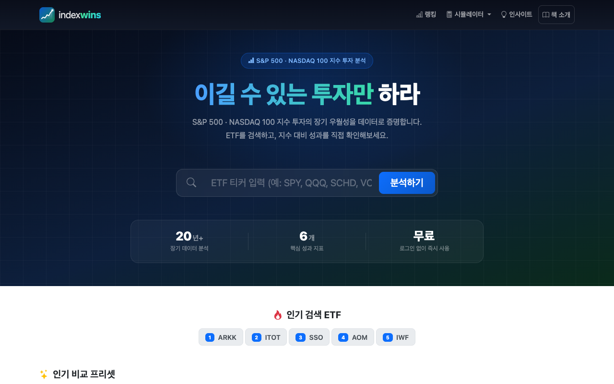
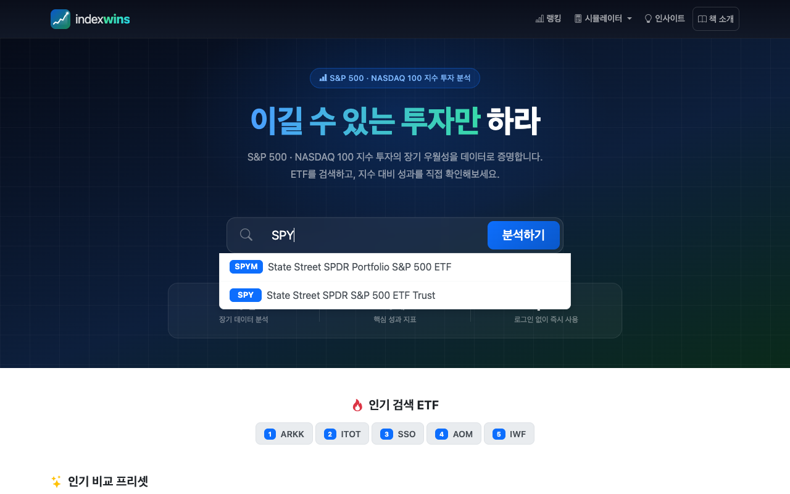
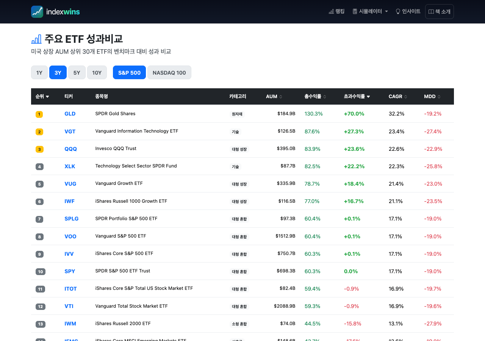
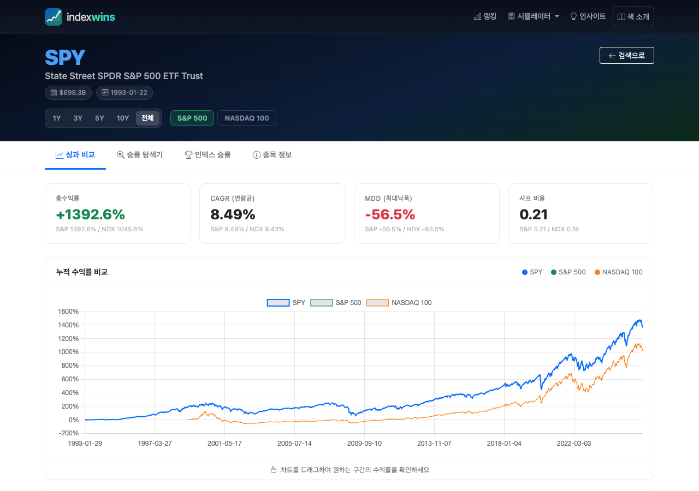
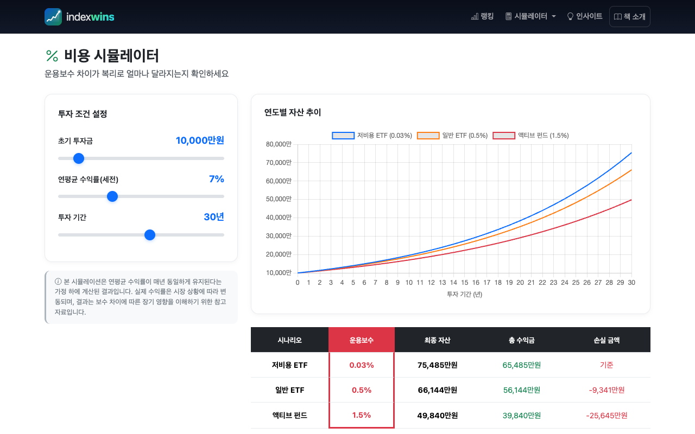
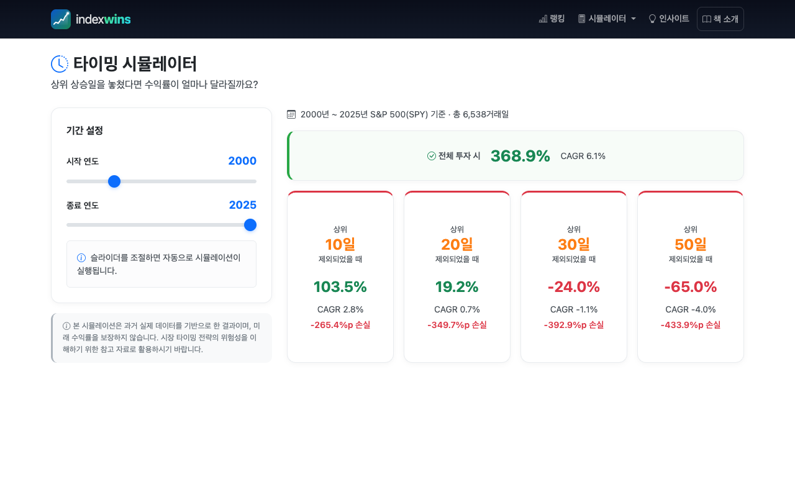
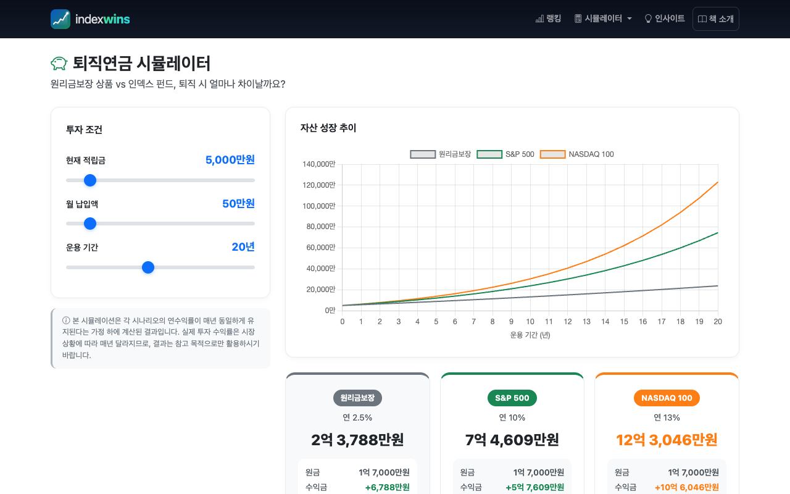
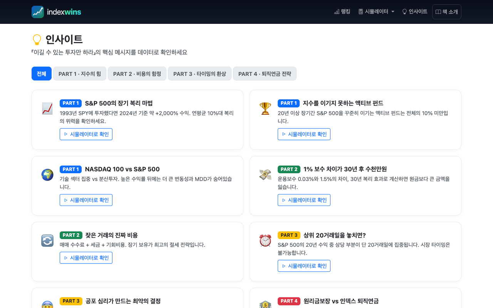

# indexwins.com 서비스 이용 매뉴얼

> 본 서비스는 『이길 수 있는 투자만 하라』의 핵심 메시지를 **실제 데이터**로 직접 확인할 수 있도록 만든 무료 웹서비스입니다.
> 로그인 없이 누구나 바로 이용할 수 있습니다.

**접속 주소: www.indexwins.com**

---

## 1. 홈 화면 — ETF 검색하기

웹사이트에 접속하면 가장 먼저 **ETF 검색창**이 나타납니다.

### 사용 방법

1. 검색창에 관심 있는 **ETF 티커**(예: SPY, QQQ, VTI)를 입력합니다.
2. 입력하면 자동으로 **검색 결과**가 드롭다운으로 표시됩니다.
3. 원하는 ETF를 클릭하거나 **[분석하기]** 버튼을 누르면 상세 분석 페이지로 이동합니다.

*검색창에 "SPY"를 입력하면 관련 ETF가 자동으로 표시됩니다.*

### 홈 화면 추가 기능

- **인기 검색 ETF**: 다른 이용자들이 많이 검색한 ETF를 바로 클릭할 수 있습니다.
- **인기 비교 프리셋**: "레버리지 ETF 비교", "배당 ETF 비교" 등 미리 준비된 비교 세트를 클릭하면 바로 분석 결과를 볼 수 있습니다.

---

## 2. 랭킹 — 주요 ETF 성과 한눈에 비교

상단 메뉴에서 **[랭킹]** 을 클릭하면 이동합니다.

미국 상장 AUM(운용자산) 상위 30개 ETF의 성과를 **S&P 500** 또는 **NASDAQ 100** 벤치마크 대비로 한눈에 비교할 수 있습니다.

### 사용 방법

1. **기간 선택**: 상단의 1Y(1년) / 3Y(3년) / 5Y(5년) / 10Y(10년) 버튼으로 분석 기간을 변경합니다.
2. **벤치마크 선택**: [S&P 500] 또는 [NASDAQ 100] 버튼으로 비교 기준 지수를 변경합니다.
3. **정렬**: 각 컬럼 헤더(총수익률, 초과수익률, CAGR, MDD 등)를 클릭하면 해당 기준으로 정렬됩니다.
4. **상세 이동**: ETF 티커를 클릭하면 해당 ETF의 상세 분석 페이지로 이동합니다.

### 주요 지표 설명

| 지표 | 의미 |
|---|---|
| **총수익률** | 선택 기간 동안의 전체 수익률 |
| **초과수익률** | 벤치마크(S&P 500 등) 대비 얼마나 더/덜 벌었는지 |
| **CAGR** | 연평균 복합 성장률 (연환산 수익률) |
| **MDD** | 최대낙폭 — 고점 대비 최대 하락 폭 |

> **핵심 포인트**: 초과수익률이 양수(녹색)인 ETF는 해당 기간 동안 지수를 이긴 ETF이고, 음수(적색)인 ETF는 지수에 진 ETF입니다. 장기간 지수를 꾸준히 이기는 ETF가 얼마나 드문지 직접 확인해보세요.

---

## 3. ETF 상세 분석 — 4가지 분석 탭

검색 또는 랭킹에서 ETF를 선택하면 **상세 분석 페이지**로 이동합니다.

### 3-1. 헤더 영역

화면 상단에 해당 ETF의 **기본 정보**(티커, 정식 명칭, 운용자산 규모, 상장일)가 표시됩니다.

- **기간 선택**: 1Y / 3Y / 5Y / 10Y / 전체 — 분석 기간을 자유롭게 변경
- **벤치마크 선택**: S&P 500 또는 NASDAQ 100과 비교

---

### 3-2. [성과 비교] 탭

첫 번째 탭에서는 선택한 ETF의 성과를 벤치마크와 직접 비교합니다.

**4가지 핵심 지표 (KPI 카드)**

| 지표 | 설명 |
|---|---|
| **총수익률** | 전체 기간 누적 수익률 |
| **CAGR (연평균)** | 복리 기준 연평균 수익률 |
| **MDD (최대낙폭)** | 투자 중 겪을 수 있는 최대 하락 폭 |
| **샤프 비율** | 위험 대비 수익의 효율성 (높을수록 좋음) |

각 카드 하단에는 S&P 500 / NASDAQ 100의 동일 지표가 함께 표시되어 바로 비교할 수 있습니다.

**누적 수익률 차트**

세 개의 선(선택 ETF, S&P 500, NASDAQ 100)이 하나의 차트에 표시됩니다. 차트를 **마우스로 드래그**하면 특정 구간의 수익률을 확인할 수 있습니다.

---

### 3-3. [승률 탐색기] 탭

"내가 아무 때나 투자를 시작해도 지수를 이길 수 있었을까?"에 대한 답을 시각적으로 보여줍니다.

- **보유 기간**(1년 / 3년 / 5년)을 선택합니다.
- 전체 거래일 중 투자를 시작할 수 있었던 모든 날을 **점(dot)**으로 표시합니다.
- 녹색 점은 **지수를 이긴 날**, 적색 점은 **지수에 진 날**입니다.
- 최종적으로 **승률**(전체 중 이긴 비율)이 표시됩니다.

> **활용 팁**: 보유 기간이 길어질수록 지수를 이기기가 더 어려워지는지, 아니면 쉬워지는지 비교해보세요.

---

### 3-4. [인덱스 승률] 탭

- **롤링 승률**: 1년 / 3년 / 5년 단위로 굴려가며 측정한 지수 대비 승률
- **연도별 비교**: 매년 해당 ETF가 벤치마크를 이겼는지 졌는지를 테이블로 확인

---

### 3-5. [종목 정보] 탭

해당 ETF의 기본 정보를 확인할 수 있습니다.

- 운용보수(%), 상장일, 운용자산 규모
- ETF 설명 (한국어 번역 버튼 제공)
- **상위 10개 보유 종목**과 비중

---

## 4. 비용 시뮬레이터 — 보수 차이의 복리 효과

상단 메뉴 **[시뮬레이터] → [비용 시뮬레이터]** 로 이동합니다.

운용보수(비용)가 장기 투자 성과에 얼마나 큰 영향을 미치는지 직접 확인할 수 있습니다.

### 사용 방법

왼쪽 패널의 **슬라이더를 조절**하여 투자 조건을 설정합니다.

| 설정 항목 | 범위 | 기본값 |
|---|---|---|
| 초기 투자금 | 100 ~ 100,000만원 | 10,000만원 |
| 연평균 수익률 (세전) | 1% ~ 20% | 7% |
| 투자 기간 | 5 ~ 50년 | 30년 |

### 결과 보는 법

오른쪽에 3가지 시나리오의 자산 성장 추이가 차트와 표로 표시됩니다.

| 시나리오 | 운용보수 | 설명 |
|---|---|---|
| **저비용 ETF** | 0.03% | S&P 500 인덱스 펀드 수준 |
| **일반 ETF** | 0.5% | 일반적인 ETF 수준 |
| **액티브 펀드** | 1.5% | 전문가가 운용하는 액티브 펀드 수준 |

> **핵심 포인트**: 연 1%의 보수 차이가 30년 후 **수천만 원**의 차이를 만듭니다. 이것이 바로 보수의 복리 효과입니다. *(본문 PART 2 참조)*

---

## 5. 타이밍 시뮬레이터 — 시장 타이밍의 위험성

상단 메뉴 **[시뮬레이터] → [타이밍 시뮬레이터]** 로 이동합니다.

"상승일을 놓치면 수익률이 얼마나 달라질까?" — S&P 500 실제 데이터를 기반으로 시장 타이밍의 위험성을 보여줍니다.

### 사용 방법

1. **시작 연도**와 **종료 연도** 슬라이더를 조절하여 분석 기간을 설정합니다.
2. 결과가 자동으로 계산됩니다.

### 결과 보는 법

- **전체 투자 시**: 해당 기간 동안 한 번도 빠지지 않고 투자했을 때의 수익률
- **상위 10일 제외**: 수익률이 가장 높았던 상위 10일을 놓쳤을 때의 수익률
- **상위 20일 제외**: 상위 20일을 놓쳤을 때의 수익률
- **상위 30일 / 50일 제외**: 더 많은 상위 거래일을 놓쳤을 때의 결과

> **핵심 포인트**: 25년간의 전체 거래일 중 **상위 30일만 놓쳐도 수익이 손실로** 바뀝니다. 시장에 머무르는 것(Time in the market)이 시장을 맞추는 것(Timing the market)보다 중요합니다. *(본문 PART 3 참조)*

---

## 6. 퇴직연금 시뮬레이터 — 원리금보장 vs 인덱스 펀드

상단 메뉴 **[시뮬레이터] → [퇴직연금 시뮬레이터]** 로 이동합니다.

퇴직연금을 원리금보장 상품에 넣어둘 때와 인덱스 펀드로 운용할 때, 퇴직 시점에 얼마나 차이가 나는지 시뮬레이션합니다.

### 사용 방법

왼쪽 패널에서 자신의 상황에 맞게 조건을 설정합니다.

| 설정 항목 | 범위 | 기본값 |
|---|---|---|
| 현재 적립금 | 0 ~ 50,000만원 | 5,000만원 |
| 월 납입액 | 0 ~ 500만원 | 50만원 |
| 운용 기간 | 5 ~ 40년 | 20년 |

### 결과 보는 법

3가지 전략의 최종 자산이 비교됩니다.

| 전략 | 연수익률 가정 | 설명 |
|---|---|---|
| **원리금보장** | 연 2.5% | 은행 예금, 보험사 원리금보장 상품 |
| **S&P 500** | 연 10% | S&P 500 인덱스 펀드 투자 |
| **NASDAQ 100** | 연 13% | NASDAQ 100 인덱스 펀드 투자 |

> **핵심 포인트**: 동일한 원금을 넣더라도 20년 후 **원리금보장과 S&P 500의 차이는 수억 원**에 달할 수 있습니다. 퇴직연금이야말로 장기 인덱스 투자의 가장 좋은 그릇입니다. *(본문 PART 4 참조)*

---

## 7. 인사이트 — 책의 핵심 메시지를 데이터로

상단 메뉴 **[인사이트]** 를 클릭합니다.

『이길 수 있는 투자만 하라』의 각 파트별 핵심 메시지를 카드 형태로 정리했습니다. 각 카드의 **[시뮬레이터로 확인]** 버튼을 클릭하면 해당 메시지를 데이터로 직접 검증할 수 있는 페이지로 이동합니다.

### 카테고리

| 필터 | 내용 |
|---|---|
| PART 1 · 지수의 힘 | S&P 500의 장기 복리 마법, 액티브 펀드의 한계 |
| PART 2 · 비용의 함정 | 운용보수의 복리 효과, 거래 비용의 진짜 크기 |
| PART 3 · 타이밍의 환상 | 시장 타이밍의 불가능성, 공포 심리의 비용 |
| PART 4 · 퇴직연금 전략 | 원리금보장 vs 인덱스 펀드 비교 |

---

## 8. 메뉴 구조 요약

| 메뉴 | 기능 | 관련 챕터 |
|---|---|---|
| **홈** | ETF 검색 + 인기 프리셋 | — |
| **랭킹** | 상위 30개 ETF 벤치마크 대비 성과 비교 | PART 1 |
| **ETF 상세** | 4탭 심층 분석 (성과/승률/인덱스승률/종목정보) | PART 1 |
| **비용 시뮬레이터** | 운용보수 차이의 장기 영향 | PART 2 |
| **타이밍 시뮬레이터** | 상위 거래일 누락의 영향 | PART 3 |
| **퇴직연금 시뮬레이터** | 원리금보장 vs 인덱스 펀드 비교 | PART 4 |
| **인사이트** | 책의 핵심 메시지 + 데이터 연결 | 전체 |
| **책 소개** | 도서 정보 및 구매 링크 | — |

---

## 이용 안내

- **접속 주소**: www.indexwins.com
- **이용 요금**: 무료
- **회원가입**: 불필요 (로그인 없이 모든 기능 이용 가능)
- **지원 기기**: PC, 태블릿, 스마트폰 (반응형 디자인)
- **데이터 출처**: Yahoo Finance (실시간 시세 반영)

> 본 서비스의 모든 데이터와 시뮬레이션 결과는 과거 실적에 기반한 참고 자료이며, 미래 수익률을 보장하지 않습니다.
